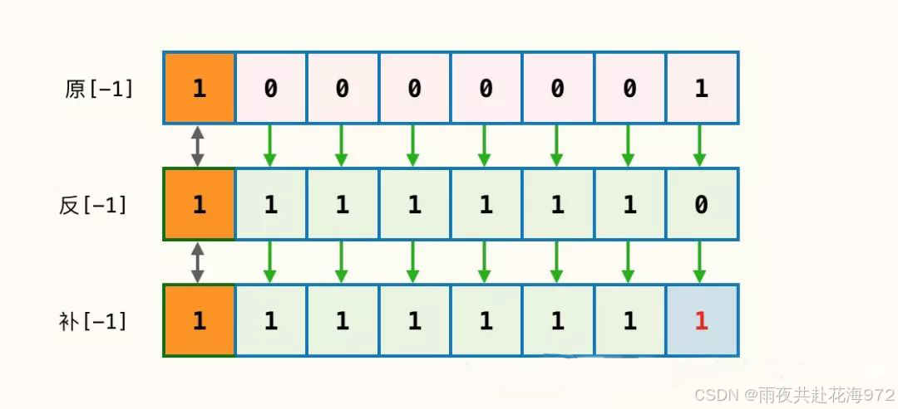

# ==*补码背后的逻辑与智慧*==
[TOC]
## 1.前言
+ 补码背后蕴含着精妙逻辑与智慧。从逻辑上看，它基于模运算，通过独特规则为负数编码。例如，对于 8 位二进制数，其模为 256。正数补码即原码，负数则是原码除符号位取反加 1。这一设计让加减法可统一为加法运算，大大简化了计算机硬件电路。在智慧方面，它巧妙利用数学原理，极大降低硬件成本，提高运算效率。而且补码的数值表示范围更合理，充分利用位数，是计算机科学中极具价值的创造。

## 2.简介

+ 书中关于补码的部分启发了我们，对一些细节进行了推敲，搞清楚了之前一直很模棱两可的东西，比如有符号整型的表示范围等问题。
+ 本文记录的是自己的学习心得。本文都是工程化的讨论，侧重点在于形象化理解，并没有严谨的论证，因为严谨的我们不擅长。
+ 关于编码方案设计补码所遵循的不间断性及唯一性（正负零问题）原则等严谨讨论。在此博客中，我们将从补码背后的逻辑的说起，详细说明补码的背后逻辑以及实际运用；再从补码的智慧开始阐述，从
### 3.补码的逻辑
> #### 3.1.补码的计算逻辑
##### （1）补码的计算
 在计算机的存储中数据通过二进制补码的方式储存，正数的补码与其原码相同，而负数则大不相同。负数的补码需要在原码的基础上进行一番“七十二变”才可以得到其补码。
例如5在二进制中被表示为0101，这就是5的原码表示。其中101表示储存的这个数的大小，而最高位的0表示的便是这个数的符号，最高位也往往被称作符号位。若符号位为0，则表示该数为正数；若符号位为1，则表示该数为负数。-5的原码就呼之欲出了：1101。
 
上图是1、2、-1、-2的原码示意图，其中黑色的表示数的大小，最高位的符号位则是用红色标明的数字。很明显可以看出上文中所提到的：若符号位为0，则表示该数为正数；若符号位为1，则表示该数为负数。
既然知道了负数的原码怎么表示，那原码怎么转变为补码呢？笔者认为下图可以清晰地解答我们心中的疑惑。
上图为-1原码转补码的示意图。在保持符号位不变的情况下，将负数的原码取反，即0变为1、1变为0得到该负数的反码，然后再将反码+1得到该负数的补码。这就是-1在计算机中存储的样式。

 #### 3.2.补码的形象化解释
 补码原理的形象化理解
本节讨论，为什么用补码就可以实现将减法运算转换成加法运算。

废话不多说，看下面这个环：

很显然，在这个环上后退 1 格和前进 7 格是一码事。

其他同理：（后退 2 格等于前进 6 格）、（后退 3 格等于前进 5 格），等等。

后退 1 格，就是减去 1；前进 7 格，就是加上 7。
 
> #### 3.3.补码的实际运用
 在计算机硬件中的应用，如 CPU 对有符号整数的运算。
在编程语言中的体现，例如各种编程语言如何处理有符号整数的补码表示。
在数字信号处理、通信等领域的应用实例。

>> ##### 3.3.1.统一表示
补码的最大逻辑优势在于它将数值的正负号和大小统一编码。在传统的原码表示法中，符号位和数值位是分开的，这导致在进行加减运算时需要额外的逻辑来处理符号位。而补码通过将数值部分进行取反加一来表示负数，使得正负数的表示在形式上更加统一，从而简化了计算机的运算逻辑。

>> ##### 3.3.2.简化运算
补码设计的另一个核心逻辑是简化了加减运算。在传统的二进制运算中，减法需要额外的逻辑来判断和处理借位。而补码通过将减法转化为加法（即A - B = A + (-B)），并利用补码表示法来表示负数，使得计算机可以通过单一的加法器来执行加减运算，极大地提高了运算效率。

>> ##### 3.3.3.数值范围与溢出处理
补码还通过其编码方式明确地定义了数值的表示范围。对于一个n位的补码，其表示的数值范围是-2^(n-1)到2^(n-1)-1。这种明确的范围定义使得计算机在进行运算时能够自动检测和处理溢出情况，从而保证了数值运算的准确性和可靠性。

### 4.补码的智慧

1. 简化加减运算：在补码系统中，加法运算可以同时处理正数、负数和零的加法，而不需要区分它们是正是负。这意味着计算机在执行加法运算时，不需要单独的加法器来处理正数和负数，从而简化了硬件设计。此外，补码还使得减法运算可以转换为加法运算，即“减去一个数”等价于“加上这个数的补码”，这进一步简化了计算过程。
2. 统一零的表示：在补码系统中，零的表示是唯一的（全零）。这与原码和反码系统中零有两种表示（正零和负零）相比，更加简洁和统一。这种统一表示避免了在处理零时可能出现的特殊情况和复杂性。
3. 在计算机中，它主要用于表示有符号整数。补码的智慧体现在多个方面。首先，它能够让计算机很方便地进行减法运算。利用补码，减法可以转换为加法来实现。例如计算5 - 3，在补码系统中，可以将其转换为5 +（-3的补码）。这样计算机的运算电路可以统一为加法电路，大大简化了硬件设计。

### 5.总结    
综上所述，补码系统背后的智慧在于它巧妙地解决了有符号数在计算机中的表示和运算问题，使得题变得更加简单、统一和高效。这种设计不仅体现了计算机科学中的智慧和创造力，也为计算机技术的发展奠定了坚实的基础。
逻辑上，它统一了加减法运算，将减法转化为加法，简化硬件电路设计。其表示范围合理，充分利用有限位数涵盖了所需的数值范围。     智慧方面，通过对原码取反加一的巧妙数学转换，使负数表示简洁统一。同时提高了运算效率，因为加法通常比减法更快，且便于进行数值比较和判断。补码是计算机科学中极具价值的表示方法。

